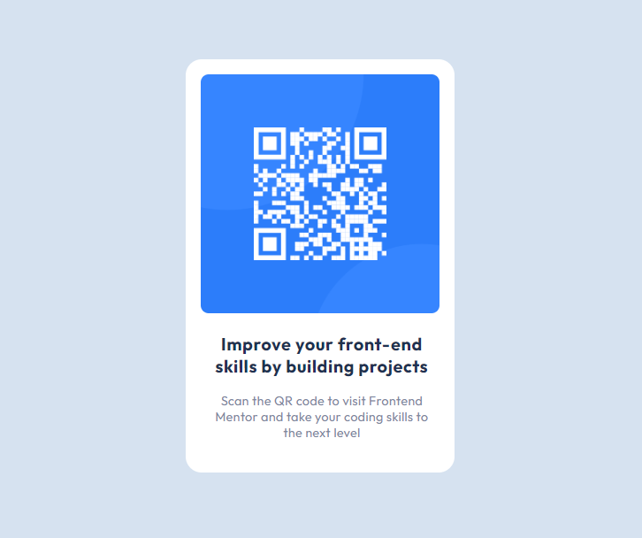

# Frontend Mentor - QR code component solution

This is a solution to the [QR code component challenge on Frontend Mentor](https://www.frontendmentor.io/challenges/qr-code-component-iux_sIO_H). Frontend Mentor challenges help you improve your coding skills by building realistic projects. 

## Table of contents

- [Overview](#overview)
  - [Screenshot](#screenshot)
  - [Links](#links)
- [My process](#my-process)
  - [Built with](#built-with)
  - [What I learned](#what-i-learned)
- [Author](#author)
- [Acknowledgements](#acknowledgements)

## Overview

### The challenge

Users should be able to:

- View the optimal layout depending on their device's screen size.
- See hover states for all interactive elements.

### Screenshot

### Links

- Solution URL: [Frontend Mentor Solution](https://www.frontendmentor.io/solutions/qr-code-component-using-html-and-css-an8aWkKWBh)
- Live Site URL: [QR Code Component]( https://muhdal-amin.github.io/qr-code-component/)

## My process

### Built with

- Semantic HTML5 markup
- CSS custom properties
- Flexbox
- CSS Grid

### What I learned

- HTML Semantics
- Clamp ()
- CSS positions

## Author

- Frontend Mentor - [@Muhdal-Amin](https://www.frontendmentor.io/profile/Muhdal-Amin)

## Acknowledgements

Special thanks to [MiguelZaga](https://www.frontendmentor.io/profile/miguelzaga) his README files helped with the clamp() and semantic HTML5 markup.